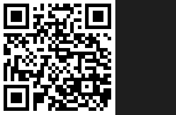

# 💡 Support GoCL

Thanks for your interest in supporting GoCL development!

Based in Zambia, where platforms like Stripe and PayPal aren't fully supported, I've set up alternative methods to receive your generous contributions.

---

### 🔗 Liberapay

Note on LiberaPay: LiberaPay serves as a buffer platform—it offers a straightforward infrastructure to collect donations and connect with potential supporters until direct payment methods become available. It functions as an intermediary “holding area,” leveraging its approach to route contributions reliably.

---

### 💰 Direct Donations

**Bitcoin (BTC):**  
`bc1qzpyzf4dmsct9eyucxdzpskv234tzm3qkv7st3m`  

**Mobile Money (Zambia):**  
- Zamtel: +260 956 124 147  
- MTN: +260 760 315 668  
- Airtel: +260 779 326 269  

---

### 💬 Why It Matters

GoCL is built to optimize GPU compute across AMD, NVIDIA, and potentially Apple — designed for regions where proprietary tools are limited or expensive.  
Your support directly fuels development under power cuts, limited access to tools, and global payment walls.

---

*All donations are non-recurring. For long-term sponsorship, contact me directly.*
