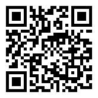

# 💡 Support GoCL

I’m based in Zambia, where Stripe and PayPal are not supported.  
If you'd like to help power GoCL’s development (hardware, backups, power costs), see below:

---

### 🔗 Liberapay

You can also find my contact info or tip via crypto/mobile money on my Liberapay profile.

---

### 💰 Direct Donations

**Bitcoin (BTC):**  
`bc1q50wuw3etcepn33fjcz9rzpk2exrl8rn32nvtcz`  

**Mobile Money (Zambia):**  
- Zamtel: +260 956 124 147  
- MTN: +260 760 315 668  
- Airtel: +260 779 326 269  

---

### 💬 Why It Matters

GoCL is built to optimize GPU compute across AMD, NVIDIA, and potentially Apple — designed for regions where proprietary tools are limited or expensive.  
Your support directly fuels development under power cuts, limited access to tools, and global payment walls.

---

*All donations are non-recurring. For long-term sponsorship, contact me directly.*
